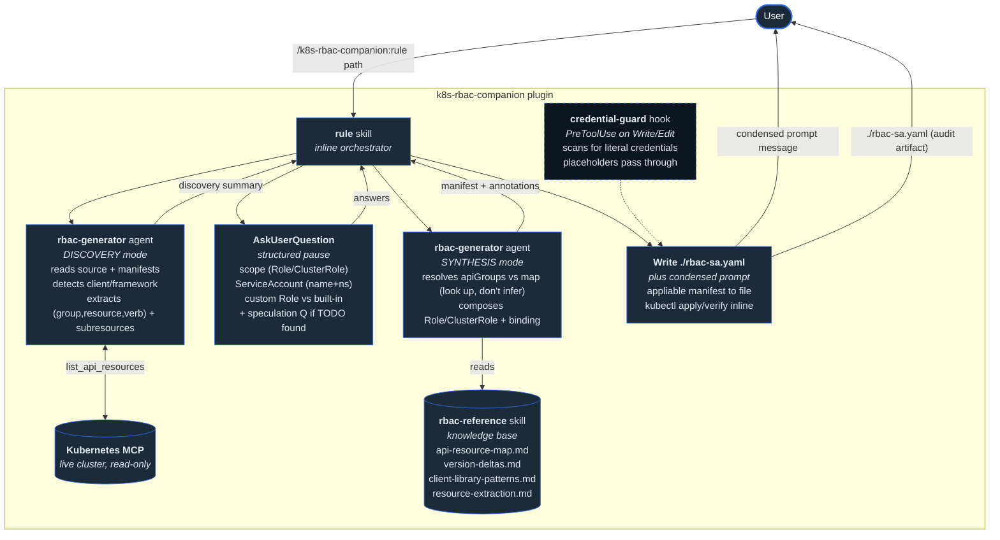

# k8s-rbac-companion

A Claude Code plugin for scoping a workload's Kubernetes access to the minimum permissions it actually needs. Reads the workload's code, infers the API access patterns (groups, resources, verbs, subresources), and generates a least-privilege `Role`/`ClusterRole` + matching binding as annotated YAML — bound to the workload's ServiceAccount. Apply it with one `kubectl` command.

---

## What it does

You point it at a workload's directory. It detects the Kubernetes client (client-go, controller-runtime, the kubernetes Python client, or kubectl), infers the API access — which `(apiGroup, resource, verb)` tuples the code uses, including subresources like `pods/log` and `<resource>/status` — asks you three targeted questions (scope, ServiceAccount, and custom-vs-built-in), and emits an RBAC manifest that grants only what the workload actually needs.

The output is a directly-appliable `rbac-<sa>.yaml` on `rbac.authorization.k8s.io/v1`, with each rule annotated by an inline `#` comment citing the source line that justifies it.

## Who it's for

**Platform and application engineers scoping a workload's Kubernetes access to the minimum necessary permissions** — a controller, operator, job, or service that talks to the API server. The pain is well-known:

- RBAC is correct-by-construction only if you get the triple right: `apiGroups` + `resources` + `verbs`. A wrong `apiGroup` (e.g. putting `ingresses` in the core group instead of `networking.k8s.io`) produces a rule that *silently grants nothing* — the authorizer matches on group, so the workload gets `Forbidden` at runtime with no syntax error to catch it.
- The mapping from code to rule is full of non-obvious cases: an informer-backed `List()` needs *both* `list` and `watch`; `kubectl exec` needs `create` on `pods/exec` (not `get`); writing `.status` needs the `<resource>/status` subresource; leader election needs `leases`.
- So teams reach for `cluster-admin` or a broad built-in (`edit`) because hand-authoring a tight Role is tedious and easy to get subtly wrong.

This plugin reads the code and derives the intent — then explains every grant back to you in terms of the line that needed it.

## Install in under 5 minutes

You need [Claude Code](https://code.claude.com/) installed and authenticated.

### Option A — Marketplace install (recommended)

In any Claude Code session:

1. Open `/plugins`
2. Add marketplace → paste `mjtrapani/k8s-rbac-companion`
3. Install **k8s-rbac-companion**
4. Restart Claude Code

### Option B — Local load (dev / one-off)

```bash
git clone https://github.com/mjtrapani/k8s-rbac-companion.git
cd k8s-rbac-companion
claude --plugin-dir .
```

To verify either install, run `/agents` — you should see `rbac-generator` in the list. You can also confirm the knowledge-base skill is active by asking something RBAC-adjacent, like *"what verbs does `kubectl exec` need?"* — the `rbac-reference` skill should auto-load (it's hidden from the slash menu by design — it's a model-invocable knowledge base, not an action command) and inform the answer.

## Use it

In Claude Code, from your repo:

```text
/k8s-rbac-companion:rule ./path/to/your/workload
```

The plugin will:

1. Detect the client/framework (e.g. `controller-runtime` from `go.mod` + `r.Get(`/`r.List(` call sites)
2. Map each API call to `(apiGroup, resource, verb)` — including subresources, leader-election `leases`, and event-recorder `events`
3. Ask you three questions: **scope** (namespaced `Role` vs cluster-wide `ClusterRole` + namespace), the target **ServiceAccount** (name + namespace), and **role style** (a custom least-privilege Role, or bind to a built-in `view`/`edit`/`admin`) — plus a conditional question if it finds a `// TODO` near K8s calls hinting at planned access
4. Write `./rbac-<sa>.yaml` to your cwd — the appliable manifest with per-rule rationale as inline comments
5. Emit a short summary with the file path and the `kubectl` commands to validate, apply, and verify

You can also invoke conversationally:

```text
scope an RBAC role for ./my-controller
```

### Apply and validate end-to-end

The strongest validation: apply the manifest and prove the workload's ServiceAccount can do exactly what it needs — and nothing else.

```bash
# 1. Validate the manifest without touching the cluster
kubectl apply -f ./rbac-my-sa.yaml --dry-run=client

# 2. Apply it
kubectl apply -f ./rbac-my-sa.yaml

# 3. Verify what the ServiceAccount can now do
kubectl auth can-i --list --as=system:serviceaccount:my-ns:my-sa

# 4. Negative test — an out-of-scope action should print "no"
kubectl auth can-i delete secrets --as=system:serviceaccount:my-ns:my-sa -n my-ns
# → no
```

A clean `auth can-i --list` showing only the intended verbs, and a `no` on step 4, means the generated rule grants exactly what the workload uses and denies the rest.

> **No bundled sample workload yet.** redis-companion ships an `examples/sample-service/` you can run end-to-end; the equivalent here — a tiny controller-runtime workload plus a kind-cluster apply/verify loop — is on the [What's next](#whats-next) list. For now, run the plugin against your own workload.

## Optional: connect a Kubernetes MCP for live verification

The plugin works fully without an MCP connection. With one, the agent reads the **live, version-exact API surface** instead of the bundled static fallback.

The MCP server (`mcp-server-kubernetes`) is pre-wired in `plugin.json` and starts automatically using your **current kubeconfig context** — no environment variable needed (it reads `~/.kube/config` like `kubectl` does). With it connected, the agent gets:

1. **`list_api_resources`** — the authoritative `resource → (apiGroup, namespaced?, verbs)` map for the *connected cluster's version*, including installed CRDs. This is the Kubernetes analog of querying the live server rather than trusting a baked-in table, and it resolves the single biggest correctness risk (which group a resource lives in).
2. **`explain_resource`** — schema/subresource disambiguation for an ambiguous kind.

> **The agent is read-only by design.** Its tool allowlist grants *only* `list_api_resources` and `explain_resource` — no `kubectl_apply`/`create`/`delete`/`patch`/`generic`. It physically cannot mutate your cluster. **Applying the manifest is always your explicit action** via the `kubectl` commands above; the plugin never applies anything for you. (This is a deliberate posture: `mcp-server-kubernetes`'s non-destructive mode actually *disables* the `auth can-i`/`--dry-run` tool, so rather than half-lock the server we lock the agent down to two read-only tools and keep apply/verify in your hands.)

If no cluster is reachable, the agent falls back to the bundled `api-resource-map.md` and notes *"version drift possible — connect a cluster for live verification."*

## How it works



The plugin uses four Claude Code primitives — **two skills** (one orchestrator, one knowledge base), **one agent**, **one hook**, **one MCP**. The `rule` skill orchestrates a three-phase flow: dispatch the agent for **discovery**, pause for **user input** via `AskUserQuestion`, then dispatch the agent again for **synthesis**. This exists because Claude Code sub-agents run single-shot — they can't pause mid-execution to ask a question — so the interactive step lives in the inline skill between two stateless sub-agent dispatches.

### Skill: `rule` (orchestrator)

In `skills/rule/`. Triggered by `/k8s-rbac-companion:rule <path>` or natural language like *"scope an RBAC role for ./my-controller"*. Runs inline. Dispatches `rbac-generator` in `DISCOVERY` mode, calls `AskUserQuestion` with the three questions (scope, ServiceAccount, role-style; plus a conditional speculation question), then dispatches the agent in `SYNTHESIS` mode with the answers. `AskUserQuestion` is the load-bearing primitive — the only mechanism that actually pauses the conversation for structured input.

After synthesis, the skill writes `./rbac-<sa>.yaml` and emits a condensed message with the apply/verify commands. **Domain note:** redis-companion wrote its artifact to a `.md` and had the user `grep` the rule out, because a long single-line ACL gets mangled by terminal copy-paste. A Kubernetes manifest is multi-line YAML that `kubectl apply -f` consumes from a file natively — so here the artifact *is* the `.yaml`, annotations carried inline as `#` comments. Same dual-output spirit, correct format for the domain.

### Skill: `rbac-reference` (knowledge base — model-invocable only)

In `skills/rbac-reference/`. **Hidden from the `/` menu** via `user-invocable: false`. Loads automatically when Claude sees Kubernetes client code or RBAC syntax (description-triggered), and is loaded explicitly by the agent. Contains the RBAC rule-grammar primer, the Role-vs-ClusterRole scope map, built-in/aggregated ClusterRoles, and four detail references that load on demand:

- `api-resource-map.md` — `resource → (apiGroup, namespaced?, verbs)` offline fallback for `list_api_resources`, plus the built-in ClusterRole rule sets
- `version-deltas.md` — apiGroup migrations/removals (PSP removed 1.25, Ingress → `networking.k8s.io/v1`, etc.). Honestly thin: RBAC's grammar and verbs are stable, so only *which group a resource lives in* is version-sensitive
- `client-library-patterns.md` — client-go / controller-runtime / Python-client / kubectl → `(group, resource, verb)`, with the non-obvious cases (informer `list`+`watch`, `Status()` → `/status`, `exec` → `create pods/exec`)
- `resource-extraction.md` — deriving the rule fields from code: resources/verbs, when to add `resourceNames`, namespace inference, subresources, and flagging fully-dynamic access

### Agent: `rbac-generator`

Task executor in `agents/rbac-generator.md`. Runs on `claude-sonnet-4-6` (the work is procedural lookup + YAML composition).

**Two-mode contract:**

- **DISCOVERY** — scan code/manifests, return a structured summary of `(apiGroup, resource, verb)` tuples, resourceNames candidates, namespaces, cluster-scoped signals, implicit needs, and speculation candidates. No questions, no synthesis.
- **SYNTHESIS** — take findings + answers, **look up** each resource's apiGroup in the reference (never infer it), and compose the annotated manifest.

**Tools — read-only by allowlist.** Per the principle that each subagent gets the narrowest tool set for its task, the agent's `tools:` allowlist grants only `Read`, `Grep`, `Glob`, `Skill`, `WebFetch`, and the two read-only MCP tools (`list_api_resources`, `explain_resource`). It has no `Write`/`Edit`/`Bash` and no mutating Kubernetes tool — it cannot apply or change anything on a cluster, by construction.

Worth calling out: the synthesis prompt's hardest instruction is *"look up the apiGroup, don't infer it."* A wrong group yields a rule that silently grants nothing. This mirrors a lesson from redis-companion — where an agent once reasoned that `PUBLISH` belonged in `@write` and silently dropped pub/sub — and the fix was the same: tighten the prompt to use the authoritative map verbatim, not semantic recall.

### Hook: `credential-guard`

PreToolUse hook on `Write`/`Edit`/`MultiEdit`/`Bash`, in `hooks/`. Scans every file write — and every Bash command string — for literal Kubernetes credentials and blocks it if found:

- ServiceAccount / OIDC bearer JWTs (`eyJ…` three-segment tokens)
- kubeconfig `token:` fields with a literal value
- embedded `client-key-data` / `client-certificate-data` (base64 private key / client cert)

Recognized placeholders pass through: `<changeme>`, `${SA_TOKEN}`, `$SA_TOKEN`, ALL_CAPS env-var-style names.

**A nuance specific to this domain:** the artifact the plugin generates — a `Role`/`ClusterRole` + binding — is **credential-free by construction**; a binding references a ServiceAccount by name, with no token anywhere. So unlike redis-companion (whose hook exists to let the agent's own `<changeme>` placeholder through), this hook rarely interacts with the agent's output at all. Its real job is the project-level invariant that **no real Kubernetes credential gets written to disk via Claude in this repo** — guarding against a user asking Claude to "just save my kubeconfig here," prompt injection, or model drift — regardless of who's driving the session.

**What the hook doesn't cover** (honest scope):
- **Best-effort for shell, and not prompt output.** It scans `Write`/`Edit`/`MultiEdit` content *and* `Bash` command strings (catching heredoc/redirect credential writes and inline `eyJ…` JWT flags) — but shell coverage is best-effort: an opaque (non-JWT) bearer token passed inline, or an obfuscated command, can still slip through. Text Claude streams into the conversation isn't scanned at all.
- **Low-entropy values pass through.** The allow-list contains `password`, `secret`, `xxx`, etc. — necessary to avoid blocking docstring examples, but a real token that happens to equal `secret` won't be caught.
- **New content only.** It scans the content being written, not credentials already on disk.
- **Not `certificate-authority-data`** — that's the public CA cert, not a secret, and is deliberately allowed.

### MCP config

Declared in `plugin.json`, wires `mcp-server-kubernetes` via `npx`. It auto-starts from your current kubeconfig context (no env var). The agent uses it read-only (`list_api_resources`, `explain_resource`) for live, version-exact group/verb verification. See *Optional MCP* above.

## How it was built — design choices worth calling out

A few portable, non-obvious decisions:

**Look up the apiGroup; never infer it.** The synthesis step resolves every resource's group against `api-resource-map.md` (or live `list_api_resources`), not training-data recall. A wrong group is the quietest possible RBAC bug — valid YAML, applies cleanly, grants nothing. This is the K8s analog of "use the authoritative map verbatim."

**Live introspection over a static snapshot.** Unlike a command-versioned system where a baked-in map is canonical, Kubernetes resources change groups across versions and clusters add CRDs. So the design prefers `list_api_resources` (live, version-exact) and treats the bundled map as a flagged fallback — rather than enumerating every resource into a static table that would compete with the live source.

**Read-only by allowlist, apply by hand.** The agent's tool allowlist is the enforcement, not just the prompt: it cannot mutate a cluster. Apply/verify stay in the user's hands via `kubectl`, with a `--dry-run=client` step first and an `auth can-i` verification after.

**Credential-free artifact, hook still present.** The generated manifest carries no secret, so the hook is pure defense-in-depth for user-authored writes — kept because "no credentials touch disk via Claude in this repo" is a guarantee worth having for free.

## Limitations

**The agent infers from source code, which has real limits.** Dynamic/unstructured client access (a `GroupVersionResource` built from runtime values, reflection-based wrappers, resource names assembled from request data) **cannot be statically resolved** — the agent flags these for you rather than papering over them with a `*` wildcard. A wildcard would defeat the entire purpose; an honest gap is better than a false least-privilege rule.

**Client-library coverage.** The plugin documents detection and mapping for client-go, controller-runtime, the kubernetes Python client, and kubectl. The client-go and kubectl mappings are high-confidence (verified against a live cluster + upstream docs). **The controller-runtime `list`+`watch` coupling and the Python client's method-naming convention are documented but not exercised end-to-end against a live controller** — they're marked MEDIUM confidence in `client-library-patterns.md`, and the agent flags rather than silently bakes any call that depends on them. Java (`fabric8`), Rust, and .NET clients aren't covered yet.

**apiGroup version sensitivity isn't programmatically derived offline.** `version-deltas.md` is hand-curated from well-known Kubernetes deprecation history. The major moves (PSP removed in 1.25, Ingress → `networking.k8s.io/v1`) are reliable; precise minor-version cutoffs are vulnerable to small errors. The mitigation is to connect a cluster — `list_api_resources` reports the correct served group for every resource on that exact version.

**`resourceNames` is inferred, never asked.** The agent adds `resourceNames` only when code accesses a specifically-named object via a compatible verb (`get`/`update`/`patch`/`delete`). It can't tighten to a name that's built dynamically, and it never asks you to confirm — a deliberate choice to keep the question set to three.

**Built-in bindings over-grant.** If you choose "bind to a built-in" (`view`/`edit`/`admin`) over a custom Role, the plugin says plainly what that over-grants versus what your code uses. `view` reads everything (incl. resources you never touch); `edit` includes `pods/exec` and impersonation.

**No live apply, by design.** The agent never applies the manifest — apply is your explicit `kubectl` action. There's also no bundled sample workload yet (see below).

## What's next

In rough priority order:

- **Bundled sample workload + kind-cluster demo loop** — a tiny controller-runtime (or client-go) workload plus an apply/`auth can-i`/negative-test script, so the plugin can be exercised end-to-end out of the box (the `examples/sample-service/` analog).
- **Derive `api-resource-map.md` from a live cluster per version** — a `build-api-resource-map.py` that runs `kubectl api-resources -o wide` and emits the map, the way the reference project derives its category map from upstream source. Keeps the offline fallback honest and regenerable.
- **Broaden + ground client-library coverage** — add Java (`fabric8`/official), Rust, and .NET, and replace the "method ≈ verb" convention + hand-curated caveats with mappings derived from each library's source or generated API reference.
- **Runtime-observed mode** — infer the rule from what the workload *actually does*, not just code-reading: capture API calls via the Audit log or an `audit2rbac`-style trace, and diagnose `Forbidden` denials against an existing role. Catches dynamic/conditional access that static analysis misses.
- **CRD-aware aggregation** — detect when a workload's CRDs should be exposed via an aggregated ClusterRole (the `aggregate-to-view/edit/admin` labels) instead of (or alongside) a standalone Role.
- **OpenShift SCC / Pod Security Admission awareness** — adjacent permission models that often travel with RBAC.

## Contact

Marko Trapani — [mjtrapani@gmail.com](mailto:mjtrapani@gmail.com). Questions, contributions, and reports of edge cases the discovery patterns don't handle are all welcome.

## Credits

Built on the structural model of [`redis-companion`](https://github.com/mjtrapani/redis-companion) — same four-primitive shape (orchestrator skill + knowledge-base skill + two-mode agent + credential hook + MCP), retargeted from Redis ACLs to Kubernetes RBAC. MCP integration uses [`mcp-server-kubernetes`](https://github.com/Flux159/mcp-server-kubernetes).

## License

MIT — see `.claude-plugin/plugin.json` for plugin metadata.
